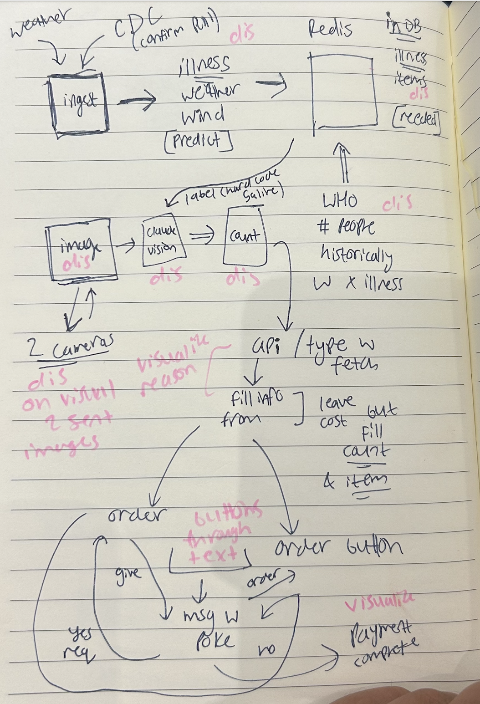

# Baymax

**A network of hospital AI agents that detect supply shortfalls and autonomously negotiate and settle inter-facility transfers — before anyone runs out.**

A supply manager states an intent in plain English through ASI:One — *"Hospital A is short on IV fluids"* — and the network takes it from there: it broadcasts the need, collects constrained offers from facilities with surplus, ranks them with Claude, composes a (possibly split) transfer, and settles it as a real on-chain testnet FET transaction — narrating every step back into the chat.

> Built at Cal Hacks for the Fetch.ai **"From Intent to Action"** challenge.
> Operational logistics only — *what to move, how much, by when.* Never clinical guidance.

---

## The problem

Hospitals run lean on consumable supplies and absorb uneven demand shocks. One facility runs critically short on an item while another a few miles away sits on a surplus of the exact same thing. Inside multi-facility health systems and regional mutual-aid compacts, this imbalance already gets reconciled — but slowly, by phone, and only if someone catches it in time.

The perception problem (counting what's on the shelf) is a solved commodity. The hard, unsolved problem is **coordination across organizational boundaries**: detecting the imbalance, matching surplus to shortfall under real constraints, and settling the transfer — autonomously, before the shortage becomes a crisis. That's a multi-agent systems problem, and it's exactly what Fetch.ai's agent mesh and Claude's reasoning make possible.

---

## What it does

Baymax runs one agent per hospital. Each agent knows its live stock (from edge vision) and its forecast demand (from weather and illness signals). The end-to-end chain:

1. **Shortfall detected** — falling stock converges with rising forecast demand.
2. **The front agent broadcasts a request** to the network over uAgents messaging.
3. **Surplus facilities answer with constrained offers** — quantity available, distance/ETA, expiry, urgency.
4. **Claude ranks the offers and composes a resolution.** When no single facility covers the need, it splits the order (e.g. **150 units from the near hospital + 50 from the far one**) or trades ETA against expiry, and re-plans on partial rejections.
5. **The transfer settles as a real transaction** via the Fetch Payment Protocol on Dorado testnet — `RequestPayment → CommitPayment → CompletePayment` — with the payment card surfacing right in the ASI:One chat for the user to sign.
6. **Everything is shown live** — a Redis-backed dashboard renders inventory, the shortfall alert, and the negotiation resolving in real time.

The moment that proves it's real: the negotiation handles a constraint — a partial offer plus a re-plan into a split transfer — and then settles an actual on-chain payment. That's what separates this from scripted message-passing.

---

## Why this is hard

Vision-based inventory monitoring and demand forecasting are rising but those platforms are single-tenant by design: each customer's data is walled off.

Baymax is a different layer entirely: **coordination across the wall**. A perception platform could sit underneath Baymax as its camera layer — it's a component, that extends and automates. The hard problem is agent-to-agent negotiation and settlement across organizational boundaries, a multi-agent systems problem, not a computer-vision one. 

---

## Tools and technologies

| Layer | What we used |
| :-- | :-- |
| **Agent mesh, chat, settlement** | Fetch.ai **uAgents** + **Chat Protocol** (v0.3.0) + **Payment Protocol** (v0.1.0), registered on Agentverse, reachable in **ASI:One** |
| **Reasoning + offer ranking** | **Claude Sonnet 4.6** via the Anthropic API — multi-constraint offer ranking and natural-language narration; entire codebase built with **Claude Code** |
| **Edge inventory (vision)** | MacBook/Pi camera → **Claude Vision** counts saline units across a green-straw divider, writing qty/surplus straight to Redis |
| **State + pub/sub** | **Redis Stack** — inventory, surplus, forecast, transfer audit stream, live event channels |
| **Forecast inputs** | Open-Meteo weather agent + a CDC/WHO illness signal agent, both writing to `forecast:{region}` in Redis |
| **Observability** | **Arize Phoenix** traces the full decision chain: inventory → forecast → reasoning → transfer → outcome |
| **Human-in-the-loop** | iMessage approval pipeline with tappable Accept/Reject links via Messages.app (AppleScript) |
| **Dashboard** | **Flask** UI auto-refreshing every 3s from Redis; SSE stream for live narration |

---

## Architecture

### The agent network

Three Fetch.ai uAgents run the negotiation:

| Agent | Facility | Role |
| :-- | :-- | :-- |
| `baymax_front` | Hospital A | **Requester + ASI:One surface.** Carries the Chat and Payment protocols; detects the shortfall, broadcasts the request, ranks offers with Claude, composes the transfer, settles it, narrates back. |
| `baymax_hospital_b` | Hospital B | **Surplus facility** — responds with constrained offers, accepts/rejects transfer legs. |
| `baymax_hospital_c` | Hospital C | Same. |

### The negotiation state machine

```
shortfall_detected → requesting → collecting_offers → evaluating
   → (re_planning if no single offer covers the need) → proposing → settling → confirmed
```

### How the layers connect

Two surfaces, one engine. **ASI:One** is the Fetch-qualifying conversational surface; the **live dashboard** is the visual story. Both are driven by the same agents and the same **Redis** state bus — the integration seam that let each track build in parallel without coupling.

```
ASI:One chat ──► front agent (uAgents)
                     │   ▲
          broadcast  │   │ narration
                     ▼   │
              hospital B & C agents
                     │
                  Redis ──► Dashboard (Flask)
                     │
              Dorado testnet (Fetch Payment Protocol)
```



**The wire contract is frozen.** `protocol.py` is the single source of truth for every cross-agent message model and the negotiation state machine. The official Fetch Chat/Payment protocol classes are re-exported unchanged — ASI:One matches by schema digest, so a local redefinition would be an incompatible protocol. No module ever redefines these.

**Every live dependency has a fail-closed fallback.** Redis, the camera, and the chain are each behind a seam in `interfaces.py` with a deterministic mock. The system is testnet-only by construction: mainnet is refused at startup; payment verification is pinned to `fetchai_stable_testnet`.

---

## How Claude is used

Claude does two jobs:

**Offer ranking.** When surplus offers arrive, Claude weighs quantity, distance, expiry date, and urgency against the shortfall. It selects a resolution — single-source if one facility covers the need, or a split transfer (e.g. 150 + 50) when none can alone. The ranking seam in `interfaces.py` sits behind a deterministic mock for offline testing.

**Shelf vision.** The camera pipeline sends a JPEG of the supply shelf to Claude Vision, which counts units per hospital across a colored divider. The count writes directly into Redis as `qty` and `surplus`, feeding the same inventory the agents read for negotiation.

The intent parser (`front_agent.parse_intent`) is currently a deterministic keyword/regex parser. A commented ASI:One-LLM seam sits behind the same signature, ready to swap in.

---

## Repository layout

| Path | What it is |
| :-- | :-- |
| `agent-communication-layer/` | The Fetch agent mesh — negotiation core, front/ASI:One agent, Payment Protocol settlement, Mailbox runners |
| `redis/` | The Redis integration seam — schema, inventory/forecast/alerts/transfers, pub/sub |
| `fetch/` | Forecast input agents (weather, illness) + the iMessage human-approval pipeline |
| `hardware/camera connection/` | Claude Vision shelf-counting → Redis |
| `arize/` | Arize Phoenix decision-chain tracing |
| `ui/` | Flask dashboard — live pipeline view, SSE narration stream, bureau subprocess management |
| `baymax_PRD_v2.md` | The full product spec |

---

## Quickstart — run the negotiation locally

```bash
cd agent-communication-layer
python -m venv .venv && source .venv/bin/activate     # Python 3.12+
pip install -r requirements.txt

# 3-agent negotiation in one process; self-exits when done.
STOCKPILE_EXIT_WHEN_DONE=1 python stockpile_agents.py
```

Pick the scenario with `STOCKPILE_ITEM`:

| `STOCKPILE_ITEM` | Demonstrates |
| :-- | :-- |
| `"IV fluids"` (default) | **Split** across two facilities (150 + 50 units) |
| `"saline"` | **Full cover** by a single facility |
| `"sutures"` | **No offer** — graceful escalation to manual procurement |

### Live Redis (optional)

```bash
# bring up Redis Stack
docker compose -f redis/docker-compose.redis.yml up -d

# seed inventory/surplus/forecast for all three hospitals
(cd redis/src && REDIS_URL=redis://localhost:6379 \
   ../../agent-communication-layer/.venv/bin/python seed_demo_data.py)

# run negotiation against live Redis
STOCKPILE_REDIS=1 STOCKPILE_ITEM="IV fluids" STOCKPILE_NEED=200 \
  STOCKPILE_EXIT_WHEN_DONE=1 python agent-communication-layer/stockpile_agents.py
```

### Dashboard

```bash
python ui/app.py
open http://localhost:5001
```

### Live ASI:One + Agentverse (Mailbox mode)

Run each agent in its own terminal, then connect each to a Mailbox from its Agentverse Inspector URL:

```bash
./.venv/bin/python run_hospital_b.py
./.venv/bin/python run_hospital_c.py
./.venv/bin/python run_front.py      # Hospital A — ASI:One chat + payment entrypoint
```

---

## Key environment variables

| Var | Effect |
| :-- | :-- |
| `STOCKPILE_ITEM` | Scenario: `"IV fluids"` (split, default) / `"saline"` (full cover) / `"sutures"` (no offer) |
| `STOCKPILE_EXIT_WHEN_DONE` | Self-exit when negotiation terminates |
| `STOCKPILE_REDIS` | `1` → read live Redis; fallback to mock on any failure |
| `REDIS_URL` | Redis endpoint (default `redis://localhost:6379`) |
| `ANTHROPIC_API_KEY` | Required for Claude Vision (camera pipeline) and offer ranking |
| `PAYMENT_VERIFY_ONCHAIN` | `false` skips cosmpy tx query — dev/spike only |
| `STOCKPILE_OFFER_TIMEOUT` | Seconds to wait for offers before evaluating (Bureau ~4s; Mailbox 30s+) |

Secrets (`.env`, `private_keys.json`) and `.venv/` are gitignored.

---

## What we proved works

- **Full live run on ASI:One + Dorado testnet:** natural-language intent → 3-hospital negotiation → split transfer → in-chat TestFET payment → on-chain settlement → confirmed. On-chain tx `912BB2030A5F14467F434D4CDB0F1DDE23EE6E72E19B9F778998D17A5046557F`.
- The negotiation **genuinely handles constraints** — partial offers trigger a re-plan into a real split, not a canned hand-off.
- A clean **Redis seam** let agents, vision, forecasting, dashboard, and observability build in parallel without coupling.
- The wired path (chat → negotiate → settle → pay) is **reproducible offline** with deterministic harnesses.

## What's next

**Near-term extensions:**
- **Ambulance and patient-acuity routing** — extend the same agent mesh to coordinate patient transfers when a facility hits capacity, ranked by acuity, ETA, and receiving-unit availability.
- **Doctor-to-agent interface** — clinicians state needs in natural language directly from the EHR; the agent layer translates intent into a negotiated transfer without touching a procurement portal.
- **Predictive restocking** — run the shortfall detector ahead of the crisis: ML demand forecasts (illness curves, seasonal peaks, scheduled procedures) trigger pre-emptive transfers before stock hits the safety threshold.
- **Expiry-driven redistribution** — agents flag near-expiry surplus and autonomously propose reallocation to high-demand facilities, reducing waste while cutting stockouts.

**Scale and federation:**
- **Live federation across health system operators** — extend the wire protocol to cross organizational boundaries, letting independent health systems opt into a regional mutual-aid mesh without sharing internal inventory data directly.
- **Supplier-side agents** — add distributor agents that quote replenishment offers alongside inter-facility transfers, so the ranker picks the globally cheapest resolution (move existing stock vs. order new).
- **Payment Protocol at production scale** — migrate from TestFET to mainnet with multi-sig approval gates and audit trails that satisfy procurement compliance.

**Broader platform:**
- **Blood and biologics routing** — time-critical, temperature-sensitive, blood-type-constrained transfers are a harder version of the same problem; the constraint model extends directly.
- **Disaster-response coordination** — broadcast a regional shortfall across the mesh when a mass-casualty event hits; each hospital agent bids available surge capacity in real time.
- **ERP / procurement integration** — write settled transfers back to SAP/Oracle as confirmed purchase orders, closing the loop from autonomous negotiation to the ledger of record.

Baymax sits on top of existing transfer workflows and hands off — it never replaces them, and it never makes a clinical call.

---

`fetch.ai` · `uagents` · `agentverse` · `asi:one` · `chat-protocol` · `payment-protocol` · `claude` · `claude-code` · `anthropic` · `redis` · `arize-phoenix` · `opencv` · `open-meteo` · `flask` · `python`
