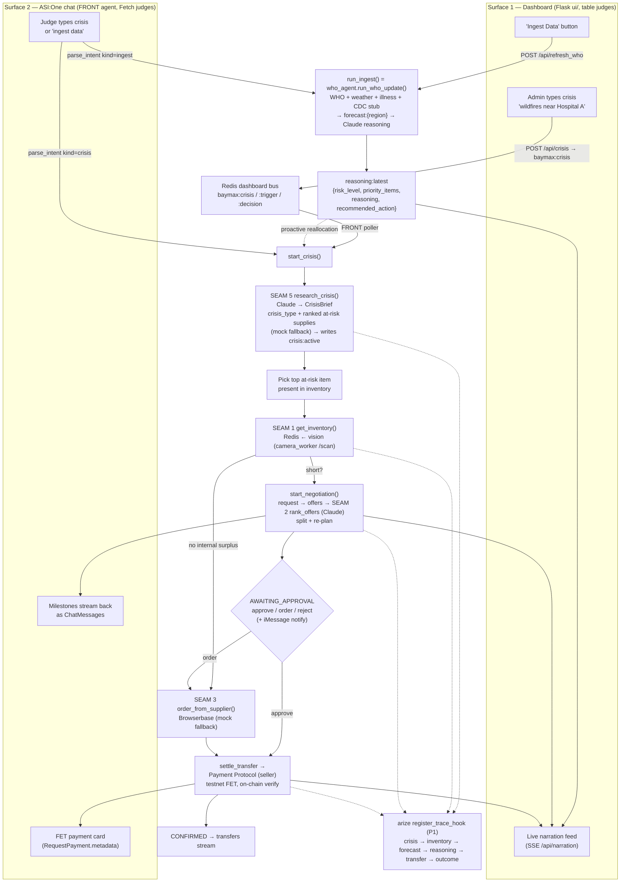

# SCOPE_AUDIT.md — Stockpile/Baymax scope realignment

**Synthesized by the lead orchestrator from 8 parallel read-only track audits** (`.swarm/audit/*.md`).
**Measured against the demo story:** crisis prompt → research → vision/inventory → negotiate-reallocate (split + re-plan) → Browserbase order fallback → testnet FET settlement, served identically on a **dashboard** (table judges) and **ASI:One chat** (Fetch judges); plus an **"Ingest Data"** forecast loop (WHO + weather + illness + CDC → Redis → Claude → proactive recs).

---

## 0. Headline: the realignment is *narrow*, because the hard parts already exist

The instinct from the task framing is "we have a supply-negotiation demo and must build a crisis/research/ingest product on top." The audits say the opposite: **most of the target already exists, just unlabeled and unwired.** The work is integration + a single new seam + cleanup, not new subsystems.

What already works end-to-end today (the head start):

| North-star capability | Already built? | Where |
| :-- | :-- | :-- |
| **One engine, two surfaces** (dashboard + chat off one negotiation core) | ✅ **Done** | `start_negotiation(reply_to=…, source=…)`; chat → ASI:One, dashboard → `baymax:narration` SSE. `wave4_dashboard_e2e_check.py` proves the dashboard path offline. |
| Negotiation: shortfall → offers → rank → **split + re-plan** → propose → settle → confirm | ✅ **Done** | `baymax_agents.py` full PRD §10 chain + `_replan_rejected_leg`; canonical 150+50 split. |
| Admin approval gate (`approve`/`order`/`reject`) | ✅ **Done** | `AWAITING_APPROVAL` → `resume_after_admin_decision`; surfaces on both surfaces. |
| **Real testnet FET settlement** (seller role, card metadata, on-chain verify) | ✅ **Done** | `settlement.py`; `RequestPayment.metadata` carries `provider_agent_wallet`+`fet_network`. |
| Browserbase external-supplier order fallback | ✅ **Done** (gated) | `interfaces.order_from_supplier` → `supplier_order.py` (`BAYMAX_BROWSERBASE=1`), fail-closed mock. |
| **Unified ingest orchestrator** (WHO + weather + illness → Redis → Claude reasoning) | ✅ **Done, mislabeled** | `fetch/agents/who_agent/fetcher.py::run_who_update(region)` aggregates all three feeds + Claude → `reasoning:latest`. |
| **"Ingest Data" button** (dashboard) | ✅ **Done, mislabeled** | `ui/app.py POST /api/refresh_who` calls `run_who_update`. Relabel, don't rebuild. |
| **Crisis-research output shape** (`{risk_level, priority_items, reasoning, recommended_action}`) | ✅ **Exists as a Redis key** | `reasoning:latest` (written by the WHO fetcher, rendered by `ui/app.py:247`). |
| Live vision → Redis inventory, **on-demand triggerable** | ✅ **Done** | `camera_worker.py /scan` + `vision_count.count_shelf()` + `capture_single.py --watch` (pub/sub `vision:capture_request`). |

**The true P0 gap is only this:** (1) no **crisis-prompt → crisis-type → ranked at-risk supplies** research step (story steps 1–2); (2) no `crisis` / `ingest` **chat-intent kinds** in `front_agent.py` (ASI:One parity); (3) **two dashboards** to consolidate + a **crisis prompt input**; (4) the **forecast→negotiation** handoff (proactive reallocation) is unbuilt. Everything else is wiring, relabeling, and cleanup.

---

## 1. Aligned with the demo story (consolidated, by north-star step)

- **Steps 3–6 (vision → negotiate → order → settle): mature and dual-surface.** `agents-mesh` is the strongest track in the repo. The seam architecture (`interfaces.py`: `get_inventory`, `rank_offers`, `order_from_supplier`, `approve_release`) is exactly the "extend via new seam, never alter signatures, fail-closed mock" pattern the realignment needs — the new research seam drops straight in.
- **Step 3 inventory source of truth: Redis + vision agree.** Seed (`redis/src/seed_demo_data.py`), camera writers, and the agent reader (`redis_inventory.py`) share key names + casing; the seeded `hospital_a` IV-Fluids shortfall + B(150)/C(80) surplus deterministically produces the 150+50 split. Vision is **on-demand triggerable** (HTTP `/scan` + pub/sub `vision:capture_request`), so a crisis flow *can* force a fresh read.
- **Step 7 ingest: the orchestrator + Claude reasoning + the dashboard button all already exist** (see §0). `reasoning:latest` is the proactive-recommendation artifact, already rendered.
- **Dashboard:** `ui/` (Flask) already renders the full 6-stage pipeline + `reasoning:latest` card + inventory grid + negotiation timeline + the approval gate; it is the **only** surface already covering steps 2 & 7.
- **Observability:** `arize/src/trace_schema.py` already names the chain (`inventory_low → forecast_signal → reasoning_decision → transfer_recommendation → decision_chain → decision_outcome`); the Phoenix OTLP exporter is real and fail-open.
- **Human gate:** `fetch/approval/imessage_client.py::notify()` is a clean, reusable, never-raises iMessage transport (the one asset of the approval track, already imported by `ui/app.py`).

---

## 2. Redundant / dead / off-track (consolidated — cut or consolidate)

**Delete (dead + risky):**
- **`fetch/shared/protocol.py`** — a hand-redefined, **frozen-contract-violating** second copy of the Payment + negotiation models (different schema digest → would silently break ASI:One card routing). **0 importers.** Delete (or reduce to `from protocol import *`). *(forecast, duplication-detective, approval)*
- **`fetch/approval/service.py` + `state.py` + `inventory_seam.py` + `serve_with_ngrok.sh`** — an orphaned **parallel second approval mechanism** with its own request IDs/state keys/links that the live engine never calls; `service.py:b_accept` even **fakes a "settled" transfer with no FET payment** (contradicts step 6). `inventory_seam.py` is a third divergent inventory reader. Keep only `imessage_client.py`. *(approval)*
- **`hello_world_agent.py`** (dead Phase-0 scaffold), **`tailscale_hosts.py` / `tailscale_smoke_test.py`** (night-of logistics), **`two_agent_payment_spike.py`** (superseded by `wave2`). *(agents-mesh)*

**Cut from git + gitignore (bloat / generated output):**
- `dump.rdb` (760 KB committed Redis snapshot), `Ch-1.jpg` (936 KB), `hardware/camera connection/capture_*.jpg` (24 files, ~10 MB) + the 2 `.json`, the tracked `__pycache__/*.pyc`, `tracks/arize/traces/*.json` (12 regenerable trace fixtures), root `__init__.py`. *(vision, observability, duplication-detective)*

**Consolidate (multiple implementations of one thing):**
- **Two dashboards:** `ui/` (Flask, pipeline + reasoning + ingest) vs `agent-communication-layer/scan_dashboard.py` (FastAPI, camera + negotiation). When Flask spawns `run_dashboard_demo.py` it boots an **orphaned second dashboard on :8079**. → Pick **`ui/` canonical**, harvest `dashboard_page.html`'s visual polish, keep `dashboard_bus.py` as the shared seam, demote/cut the FastAPI surface. *(dashboard)*
- **Four camera→Redis writers:** green-straw `bottle_counter.py`/`sync_to_redis.py` vs one-shelf `camera_worker.py`/`capture_single.py`. Live dashboard uses the one-shelf model → make `camera_worker`+`vision_count` canonical; preserve only the keyless `--counts` test path and the `--watch` pub/sub trigger. *(vision)*
- **Three Redis inventory readers:** `interfaces.get_inventory`→`redis_inventory.py` (canonical), `ui/app.py` inline reads, `fetch/approval/inventory_seam.py` (dies with the service). Standardize on the seam. *(approval, redis-bus)*
- **Dead Redis fan-out:** `channels:events`/`channels:alerts` have **no subscriber** (dashboard uses `baymax:narration`); `transfers`/`alerts:log` streams are **read by the dashboard but written only by the demo** (the live negotiation never calls `log_transfer`). `vector_history`/`history:usage` orphaned (pulls `sentence-transformers`+`numpy`). `alerts.py` off the live path. *(redis-bus)*
- **Dead forecast message models:** `Weather/Illness/WhoUpdate` in `fetch/agents/*/models.py` are never sent (every `ctx.send` is a TODO; Redis is the bus). `mock_cdc_feed.json` is unwired. *(forecast)*

---

## 3. Buggy / risky (consolidated, severity-ranked)

| Sev | Issue | Location | Fix |
| :-- | :-- | :-- | :-- |
| 🔴 **Security** | **`private_keys.json` committed to git** (real testnet identity+wallet keys for `baymax_hello`), added in `a0d55e4`. Root `.gitignore` omits it. | `adyan-agent-communication-layer/private_keys.json` | `git rm --cached`, add to `.gitignore`, **rotate keys**. File stays on disk (per spec). |
| 🔴 **Contract** | `fetch/shared/protocol.py` redefines Payment models → schema-digest mismatch if ever imported. | `fetch/shared/protocol.py` | Delete (see §2). |
| 🟠 **Correctness** | `order N <item>` at the approval gate **silently drops N** — `parse_decision` returns bare `"order"`, `_order_path` orders `neg["need"]`, but the banner tells the admin to type a quantity. | `front_agent.parse_decision`, `baymax_agents._order_path` | Capture N in `parse_decision` + thread to `_order_path`, **or** fix the banner. |
| 🟠 **Correctness** | `run_who_update` does raw `r.set(forecast:{region})` after manual read-merge → **clobbers** a concurrent weather/illness write (no atomicity). | `who_agent/fetcher.py:468` | Use `redis_io.upsert_forecast_items`. |
| 🟠 **Schema drift** | Inventory record `reserve`/`pct`/`status` disagree across **3 writers**; reader's `reserve` branch is **dead** (no writer sets it); `vision_sync` writes neither `pct` nor `surplus`; 3 different `status` vocabularies. CLAUDE.md's "camera writes `reserve`" is **false**. | `redis/src/{inventory,vision_sync}.py`, `hardware/.../sync_to_redis.py`, `camera_worker.py`, `redis_inventory.py` | Pick one writer + one record shape; resolve `reserve`. |
| 🟠 **Silent-wrong** | Live forecast agents flatten **scalar keys** into `forecast.items`; `alerts.py` expects per-item `predicted_demand_increase_pct` → demand-rising branch silently never fires. Smoke test asserts a **flat illness schema no agent produces** (false confidence). | `redis/src/{forecast,alerts}.py`, `fetch/scripts/redis_smoke_test.py` | Pin the per-item forecast sub-shape; fix the smoke test. |
| 🟡 | `ui/app.py` SSE replays the **entire** narration log to every new subscriber and **never breaks on disconnect** (generator leak); opens SSE on load *and* on Run (dup streams). | `ui/app.py` `/api/narration` | Adopt the per-connection pub/sub pattern from `scan_dashboard.py`. |
| 🟡 | `ui/app.py` decision/trigger use **LPUSH** while the poller does **LPOP** → LIFO (inverts with 2 queued). | `ui/app.py` vs `dashboard_bus.py` | RPUSH everywhere. |
| 🟡 | In-process `NEGOTIATIONS` / `_PAYMENT_PENDING` globals are **single-process only** — a distributed Mailbox deploy of A/B/C loses state. | `baymax_agents.py` | Stay single-process for the demo (`run_dashboard_demo.py`), or move to `ctx.storage`/Redis. |
| 🟡 | `camera_worker.scan()` swallows Vision errors to `count=0` → a flaky key reads as **max shortfall** and could spuriously trigger a "crisis." | `camera_worker.py:170` | Surface `source="fallback-0"` to the trigger logic; don't negotiate on a fallback 0. |
| 🟡 | Arize is **entirely disconnected** from the live system (0 imports) — a post-hoc fixture writer, not instrumentation. `trace_store.py` writes the wrong dir; second-granularity filenames collide; no shared `trace_id`. | `arize/src/*` | Wire via a `register_trace_hook` (mirror `register_settlement_hook`); add correlation id. **P1.** |
| 🟡 | `BAYMAX_REQUIRE_FACILITY_APPROVAL=on` **fail-closes to deny-all** (no real channel). | `interfaces.approve_release` | Leave off for the demo; document the footgun. |

**Testing reality:** the harnesses (`wave2/3/4_e2e_check.py`, `BAYMAX_SELFTEST`) cover negotiation/settlement/dashboard well, but **crisis/research/ingest have zero tests because they have zero code**, and vision/forecast/approval/observability have no harness. New P0 code must extend `wave2`/`wave3` (the spec's gate) or add a `wave5_crisis_e2e_check.py`.

---

## 4. Canonical layout recommendation

One engine dir, one redis track, one dashboard, one ingest orchestrator, one approval transport.

```
CalHax/
├── agent-communication-layer/   # CANONICAL engine. protocol.py FROZEN. Add research_crisis seam here.
├── redis/                        # CANONICAL state bus. Document reasoning:latest + baymax:* + new crisis:active.
├── fetch/
│   ├── agents/                   # Forecast agents. who_agent/fetcher.run_who_update = the ingest orchestrator (promote/alias to run_ingest).
│   │   └── (weather, illness, who, + CDC stub wired)
│   ├── approval/                 # KEEP imessage_client.py ONLY. Delete service/state/inventory_seam/ngrok.
│   └── shared/                   # KEEP redis_io.py. DELETE protocol.py (frozen-contract violation).
├── hardware/camera connection/   # Vision. Canonical writer = camera_worker + vision_count; purge capture_*.jpg.
├── arize/                        # Observability. Wire via register_trace_hook. tracks/arize/ = gitignored output.
├── ui/                           # CANONICAL dashboard (Flask). Add crisis prompt + relabel ingest. Harvest dashboard_page.html polish.
└── adyan-agent-communication-layer/   # KEEP — secrets + venv ONLY (.env, .venv). Untrack private_keys.json.
```

- **`adyan-agent-communication-layer/` is NOT deleted** — it is the live secrets/venv store (`.venv` + `.env` confirmed on disk). Only the *committed* `private_keys.json` leaves git.
- **`tracks/`** holds only generated Arize output → gitignore it; it is not a source track.
- **Naming:** code is `baymax_*`/`BAYMAX_*` (live truth); the root README's `stockpile_*`/`STOCKPILE_*` commands **reference files/env vars that do not exist** and will fail. Cheapest correct fix = **update the README + docstrings to `baymax_*`**. A full code rename to `stockpile_*` has large blast radius (every `BAYMAX_*` env var, agent seeds → **addresses change** → breaks the manual Mailbox connect). **Decision required (see §7).**

---

## 5. The true gap list (what to actually build for the demo)

1. **`research_crisis` seam** (NEW SEAM 5 in `interfaces.py`) — `research_crisis(crisis_text, region) -> CrisisBrief` with `{crisis_type, ranked at_risk supplies (mapped to KNOWN_ITEMS), rationale}`; Claude backend (`claude_research.py`, env-gated) + deterministic mock fallback. Mock always returns ≥1 known item so the offline demo works. Writes `crisis:active` to Redis.
2. **`crisis` + `ingest` chat-intent kinds** in `front_agent.parse_intent`/`on_intent` → ASI:One parity. `crisis` → `start_crisis()` (research → pick at-risk item → existing `start_negotiation`); `ingest` → `run_ingest()` (the WHO fetcher) → narrate `reasoning:latest`.
3. **Dashboard crisis prompt** (`POST /api/crisis` → `baymax:crisis` bus → FRONT poller → `start_crisis(source="dashboard")`) + **relabel** `/api/refresh_who` → "Ingest Data", on the **one** canonical dashboard.
4. **Forecast→negotiation handoff** — `reasoning:latest.priority_items` should be able to drive a proactive `start_negotiation`/`start_order` (the "proactive reallocation/purchase recommendation" of step 7).
5. **Cleanup** (security + bloat + dead code + consolidation) per §2/§3 — gated so offline harnesses still import.

---

## 6. Target end-to-end flow — BOTH demos, one engine (mermaid)



Both surfaces funnel into the **same** `start_crisis`/`start_negotiation`/`run_ingest` functions; the only difference is `reply_to=<chat sender>` (ASI:One) vs `source="dashboard"` (SSE). No duplicate implementations.

---

## 7. Decisions for the lead (consolidated open questions)

1. **Crisis→item selection rule:** research returns a *ranked* at-risk list; `start_negotiation` needs *one* `(item, requester, quantity)`. Recommended: pick the **top at-risk item that is `present` in inventory AND below threshold**; let inventory derive the shortfall (`quantity_needed=None`). Fall back to the top-ranked item if none is short (so the demo still negotiates). **Confirm.**
2. **Is `reasoning:latest` the official research key, and do we add `crisis:active` for the prompt?** Recommended: yes — `crisis:active = {crisis_text, crisis_type, region, at_risk, rationale, created_at}`; document both in `redis_contract.md`. **Confirm.**
3. **CDC stub in scope?** `mock_cdc_feed.json` is unwired and ~identical to the illness feed. Recommended: wire it as a distinct 4th source inside `run_ingest` (cheap, satisfies the spec's "+ CDC stub"). **Confirm.**
4. **Naming:** fix the README to `baymax_*` (cheap, recommended) vs full rename to `stockpile_*` (large blast radius, address drift). **Decide.**
5. **Wire `transfers` stream from live settlement** so the dashboard transfer panel is real (today demo-only)? Recommended: yes, one `log_transfer` call in `settlement`/`baymax_agents` on CONFIRMED. **Confirm (P1).**
6. **Single-process for the demo?** The `NEGOTIATIONS` global requires it. Recommended: yes (`run_dashboard_demo.py` for the dashboard; `run_front.py` + B/C runners for ASI:One). **Confirm.**
7. **Secret remediation now?** Untrack + gitignore `private_keys.json` and rotate the testnet keys. Recommended: yes, immediately (part of P0 cleanup). **Confirm.**

---

## 8. Cross-track dependency map (for sequencing the build)

- **Redis is the hub.** Every track reads/writes it. Key-name changes ripple to: `redis_inventory.py` (agents), `ui/app.py` (dashboard), `who_agent/fetcher.py` (forecast), camera writers (vision). → **New keys (`crisis:active`) are additive and safe; renames are not.**
- **Research seam** (NEW) lives in `agent-communication-layer/interfaces.py`, is consumed by `front_agent.py` (chat) and the dashboard poller, and writes `crisis:active` (redis). Depends on nothing downstream — **Wave A foundation.**
- **Ingest** path already spans `ui/app.py` → `fetch/agents/who_agent/fetcher.py` → `redis/` → Claude. The chat `ingest` kind reuses the same function. **No new orchestrator needed — promote/alias the existing one.**
- **Vision** feeds `get_inventory` purely through Redis keys (not a Python import); a crisis flow forces a fresh read via the existing `/scan` or `vision:capture_request` trigger.
- **Arize** observes everything but imports nothing today — wire last, via a one-way hook, so the frozen core and offline harnesses stay clean.
- **Approval** collapses to one gate (agent-layer `AWAITING_APPROVAL`) + one transport (`imessage_client.notify`); the crisis flow reuses it with **zero new approval code**.

---

*Full per-track detail in `.swarm/audit/{agents-mesh,redis-bus,vision,forecast,dashboard,observability,approval,duplication-detective}.md`.*
